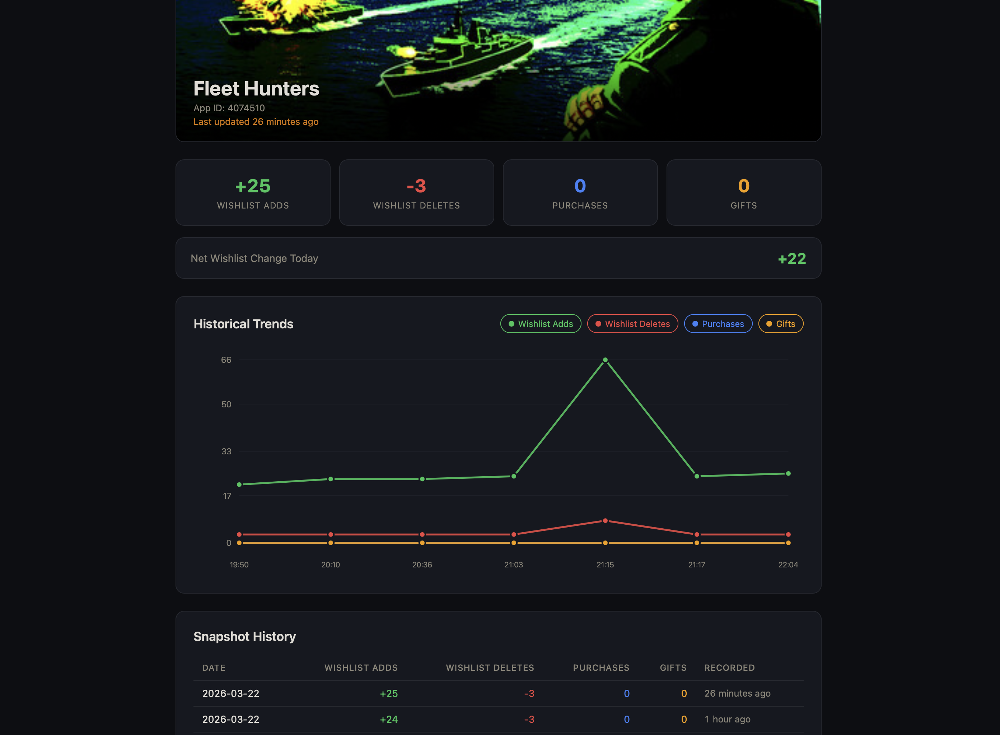

**Stop refreshing Steamworks.** Wishlist Pulse monitors your Steam wishlist numbers via the official [Wishlist Data API](https://steamcommunity.com/groups/steamworks/announcements/detail/499474120884358024) and pushes changes — adds, removes, purchases, gifts — straight to Telegram and Discord the moment they happen.

Single binary (~4 MB), built-in web dashboard, SQLite storage, minimal RAM — runs happily on a Raspberry Pi.

---

## Why

If you ship games on Steam, you know the drill: refreshing the Steamworks stats page hoping to catch wishlist movement after a trailer drop or a Next Fest. In March 2026 Valve opened the Wishlist Data API, giving developers programmatic access to wishlist totals, country breakdowns, and language splits for the first time.

Wishlist Pulse sits on top of that API. It polls [`GetAppWishlistReporting`](https://partner.steamgames.com/doc/webapi/IPartnerFinancialsService#GetAppWishlistReporting) for each of your tracked games, diffs against the last snapshot, and delivers updates to Telegram and Discord. No more checking — the data comes to you.


---

## Features

- **Real-time Telegram & Discord notifications** — adds, deletes, purchases, gifts, with deltas
- **Track multiple games** from a single instance
- **Historical data** with configurable retention for spotting trends
- **Web dashboard** — manage games, view stats, configure everything visually
- **Telegram bot commands** — track/untrack games and manage subscriptions from chat
- **Discord bot with slash commands** — same controls available via Discord
- **Two access levels** — Admin (full control) and Read-only (dashboard view)

---

## Telegram Bot

Manage everything directly from Telegram:

| Command             | What it does                            |
| ------------------- | --------------------------------------- |
| `/track <app_id>`   | Start tracking a game                   |
| `/untrack <app_id>` | Stop tracking a game                    |
| `/list`             | Show all tracked games                  |
| `/subscribe`        | Subscribe a channel to a game's updates |
| `/unsubscribe`      | Unsubscribe from a game                 |
| `/subscriptions`    | List active subscriptions               |
| `/status`           | Check bot and polling status            |


## Discord Bot

Use Discord slash commands to manage tracking and subscriptions:

| Command                  | What it does                              |
| ------------------------ | ----------------------------------------- |
| `/track <app_id>`        | Start tracking a game                     |
| `/untrack <app_id>`      | Stop tracking a game                      |
| `/list`                  | Show all tracked games                    |
| `/subscribe <app_id>`    | Subscribe this channel to a game's updates|
| `/unsubscribe <app_id>`  | Unsubscribe from a game                   |
| `/subscriptions`         | List this channel's subscriptions         |
| `/status`                | Fetch current wishlist stats              |
| `/whoami`                | Show your Discord user ID                 |

## Web Dashboard

A built-in admin panel served from the same binary — no separate deploy:

- View all tracked games with latest stats and store images
- Add/remove games by App ID or Steam store URL
- Configure Steam API key and Telegram bot token
- Manage channel subscriptions and data retention
- Secured with Argon2 password hashing, JWT sessions, rate-limited login, and HTTPS cookies

<table>
  <tr>
    <td></td>
    <td></td>
  </tr>
</table>

---

## Getting Started

### Prerequisites

- **Steam Financial API Group Web API Key** — the Wishlist Data API uses the same financial permissions as the Sales Data API. See the [Steamworks docs](https://partner.steamgames.com/doc/webapi/IPartnerFinancialsService) for provisioning instructions. Note: Financial API Groups have access to all apps on your partner account and cannot be scoped to individual apps.
- **Telegram bot token** from [@BotFather](https://t.me/BotFather)
- **Discord bot token** *(optional)* from the [Discord Developer Portal](https://discord.com/developers/applications)

### Install

#### Shell script (macOS / Linux)

```bash
curl --proto '=https' --tlsv1.2 -LsSf https://github.com/hortopan/steam-wishlist-pulse/releases/download/v0.1.0/wishlist-pulse-installer.sh | sh
```

#### Homebrew

```bash
brew install hortopan/tap/wishlist-pulse
```

#### Docker

```bash
docker run -p 3000:3000 -v wishlist-pulse-data:/data ghcr.io/hortopan/steam-wishlist-pulse:latest
```

Multi-arch image (amd64/arm64) available on [GitHub Container Registry](https://ghcr.io/hortopan/steam-wishlist-pulse).

#### Manual download

Prebuilt binaries for all platforms are available on the [Releases](https://github.com/hortopan/steam-wishlist-pulse/releases/latest) page:

| Platform | File |
| --- | --- |
| Apple Silicon macOS | `wishlist-pulse-aarch64-apple-darwin.tar.xz` |
| Intel macOS | `wishlist-pulse-x86_64-apple-darwin.tar.xz` |
| x64 Windows | `wishlist-pulse-x86_64-pc-windows-msvc.zip` |
| ARM64 Linux | `wishlist-pulse-aarch64-unknown-linux-musl.tar.xz` |
| x64 Linux | `wishlist-pulse-x86_64-unknown-linux-musl.tar.xz` |

### Build from source

Requires **Rust toolchain** and **Node.js**.

```bash
git clone git@github.com:hortopan/steam-wishlist-pulse.git
cd wishlist-pulse-bot
cargo build --release
./target/release/wishlist-pulse
```

### Run

```bash
wishlist-pulse
```

Open `http://localhost:3000` to start the setup wizard.

### Initial Setup

On first launch, the web interface guides you through configuration:

1. **Set an admin password** — if you didn't set one via the `ADMIN_PASSWORD` environment variable, the wizard will ask you to create one. You can also set an optional read-only password for view-only access.
2. **Enter your Steam API key** — paste your Financial API Group Web API Key so the bot can pull wishlist data.
3. **Connect your Telegram bot** — enter your bot token from @BotFather and add the Telegram user IDs that should have admin access to bot commands.
4. **Connect your Discord bot** *(optional)* — enter your Discord bot token and configure admin user IDs.
5. **Add games to track** — enter Steam App IDs or paste store URLs. The bot starts polling immediately.

Once configured, the bot runs autonomously — polling Steam, diffing snapshots, and pushing notifications to any subscribed Telegram and Discord channels.

### Configuration

Options can be set via CLI flags, environment variables, or both (passwords are env-only):

| Flag                      | Env Var                 | Default                                 | Description                                 |
| ------------------------- | ----------------------- | --------------------------------------- | ------------------------------------------- |
| `--bind-web-interface`    | `BIND_WEB_INTERFACE`    | `0.0.0.0:3000`                          | Web UI address                              |
| `--database-path`         | `DATABASE_PATH`         | `~/.local/share/wishlist-pulse/data.db` | SQLite database location                    |
| —                         | `ADMIN_PASSWORD`        | *(set via UI)*                          | Admin password (env only)                   |
| —                         | `READ_PASSWORD`         | *(set via UI)*                          | Read-only password (env only)               |
| `--poll-interval-minutes` | `POLL_INTERVAL_MINUTES` | `5`                                     | Steam polling interval                      |
| `--insecure`              | —                       | `false`                                 | Disable HTTPS cookie requirement (dev only) |

Passwords must be set via environment variables (not CLI flags). Other options accept CLI flags or env vars, but the same option cannot appear in both. Everything else — API keys, Telegram config, tracked games, retention — is managed through the dashboard.

---

## Under the Hood

A single Rust binary running four concurrent subsystems: a **polling loop** that diffs wishlist snapshots, a **Telegram bot** and a **Discord bot** for commands and notifications, and a **web server** serving the embedded Svelte dashboard. All data lives in SQLite (WAL mode) — no external database needed.

|          |                                                                       |
| -------- | --------------------------------------------------------------------- |
| Backend  | Rust — Axum, Teloxide, Serenity, rusqlite                              |
| Frontend | Svelte + TypeScript (Vite), embedded at compile time via `rust-embed` |
| Auth     | Argon2 + JWT                                                          |

---

## License

See [LICENSE](LICENSE) for details.
