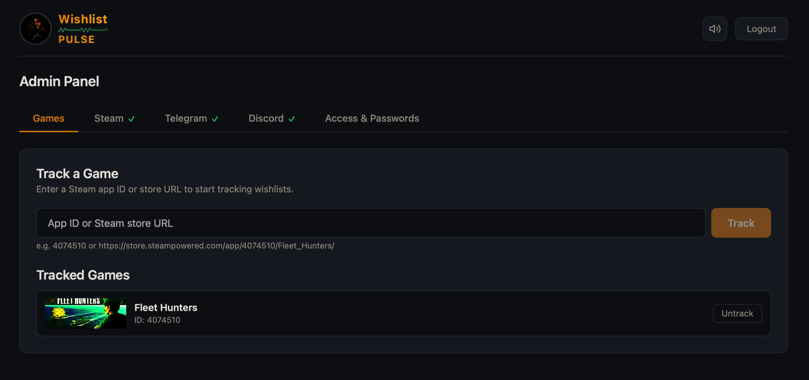
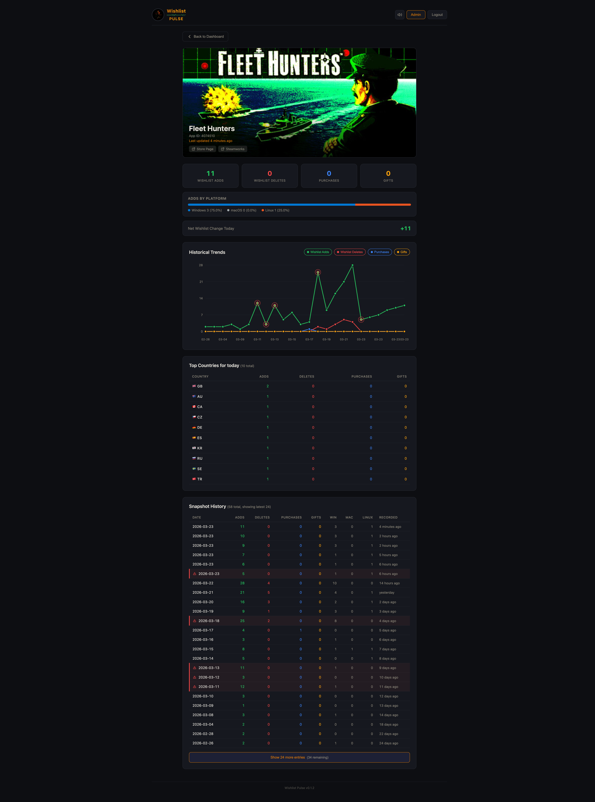
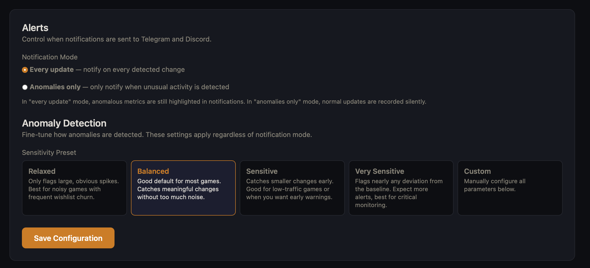
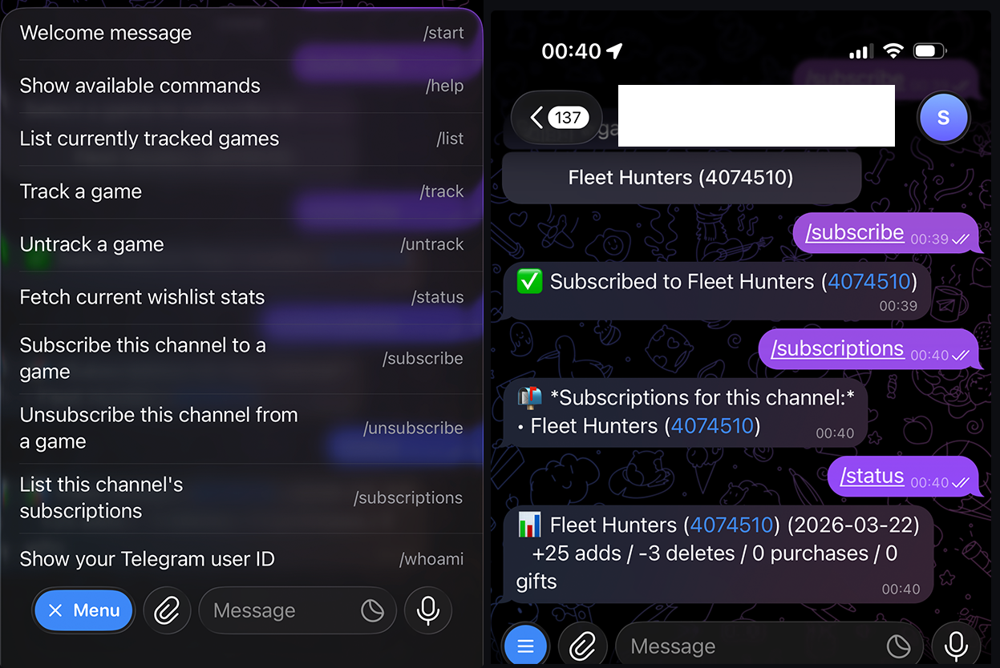

**A wishlist monitoring tool for game developers publishing on Steam.**

**Stop refreshing Steamworks.** Wishlist Pulse syncs your complete wishlist history from Steam's official [Wishlist Data API](https://steamcommunity.com/groups/steamworks/announcements/detail/499474120884358024), detects anomalies in real time, and pushes what matters — adds, removes, purchases, gifts, regional surges — straight to Telegram and Discord. Spot the impact of a trailer drop within hours, catch unexpected regional spikes after an influencer mention, and build a full timeline of every game you're tracking — all without opening Steamworks once.

Single binary (~4 MB) for **Windows, macOS, and Linux** (including ARM). Built-in web dashboard with charts and anomaly highlights, SQLite storage, minimal RAM — runs happily on a Raspberry Pi.

---

### ⚡ Quick Start

> **1.** Install:
> ```bash
> curl --proto '=https' --tlsv1.2 -LsSf https://github.com/hortopan/steam-wishlist-pulse/releases/download/v0.1.10/wishlist-pulse-installer.sh | sh
> ```
> Or via [Homebrew](#homebrew), [Docker](#docker), or [download a binary](https://github.com/hortopan/steam-wishlist-pulse/releases/latest).
>
> **2.** Run it:
> ```bash
> wishlist-pulse
> ```
>
> **3.** Open **http://localhost:3000** — the setup wizard will ask for your **[Steam Financial API Group Web API Key](https://partner.steamgames.com/doc/webapi/IPartnerFinancialsService)** and walk you through the rest.
> *(Steamworks → Users & Permissions → Manage Groups → create a Financial API Group with **General** and **Financial** permissions)*
>
> That's it. Telegram and Discord bots are optional — add them later from the dashboard.

---

## Features

- **Real-time Telegram & Discord notifications** — adds, deletes, purchases, gifts, with deltas
- **Anomaly detection** — highlights unusual activity using a modified z-score algorithm so you can cut through the noise and catch what matters
- **Configurable alert modes** — receive every update or only anomalies, with four sensitivity presets (Relaxed → Very Sensitive) plus full custom tuning
- **Track multiple games** from a single instance
- **Full historical data** synced from Steam for spotting trends
- **Web dashboard** — manage games, view stats, configure alerts visually
- **Telegram & Discord bot commands** — track/untrack games and manage subscriptions from chat
- **Two access levels** — Admin (full control) and Read-only (dashboard view)



---

## Web Dashboard

A built-in admin panel served from the same binary — no separate deploy:

- View all tracked games with latest stats and store images
- Add/remove games by App ID or Steam store URL
- Configure Steam API key and bot tokens
- Manage channel subscriptions
- Configure anomaly detection sensitivity and notification preferences
- Secured with Argon2 password hashing, JWT sessions, rate-limited login, and HTTPS cookies



## Anomaly Detection & Notifications

By default, every wishlist change triggers a notification. If that's too noisy, switch to **Anomalies only** mode — you'll only be notified when the change is statistically unusual compared to recent history.

| Mode              | Behaviour                                                                 |
| ----------------- | ------------------------------------------------------------------------- |
| **Every update**  | Notify on every change (default). Anomalous metrics are still highlighted |
| **Anomalies only**| Notify only when unusual activity is detected. Normal changes are recorded silently |

When anomaly detection doesn't have enough history yet (fewer than 3 snapshots), it falls back to notifying on every change so you never miss early data.

<details>
<summary><strong>Sensitivity presets</strong></summary>

All presets are one-click selectable from the dashboard's **Alerts** tab:

| Preset             | Lookback | Sensitivity (up/down) | Min absolute | MAD floor | Best for                                |
| ------------------ | -------- | --------------------- | ------------ | --------- | --------------------------------------- |
| **Relaxed**        | 14 days  | 3.0 / 3.0             | 10           | 10%       | Noisy games with frequent churn         |
| **Balanced**       | 14 days  | 2.0 / 2.0             | 5            | 5%        | Good default for most games             |
| **Sensitive**      | 7 days   | 1.5 / 1.5             | 2            | 2%        | Low-traffic games or early warnings     |
| **Very Sensitive** | 7 days   | 1.0 / 1.0             | 1            | 0%        | Critical monitoring — flags nearly any deviation |
| **Custom**         | —        | —                     | —            | —         | Full manual control over all parameters |

</details>

<details>
<summary><strong>How anomaly detection works</strong></summary>



The detector uses a **modified z-score** (Median + MAD) over the lookback window. Each metric — adds, deletes, purchases, gifts — is evaluated independently, with separate sensitivity thresholds for upward spikes and downward drops. Country-level anomalies are detected too, so you can spot regional surges after a localized event.

</details>

---

## Install

### Shell script (macOS / Linux)

```bash
curl --proto '=https' --tlsv1.2 -LsSf https://github.com/hortopan/steam-wishlist-pulse/releases/download/v0.1.10/wishlist-pulse-installer.sh | sh
```

### Homebrew

```bash
brew install hortopan/tap/wishlist-pulse
```

### Docker

```bash
docker run -p 3000:3000 -v wishlist-pulse-data:/data ghcr.io/hortopan/steam-wishlist-pulse:latest
```

Multi-arch image (amd64/arm64) available on [GitHub Container Registry](https://ghcr.io/hortopan/steam-wishlist-pulse).

### Manual download

Prebuilt binaries for all platforms are available on the [Releases](https://github.com/hortopan/steam-wishlist-pulse/releases/latest) page:

| Platform            | File                                               |
| ------------------- | -------------------------------------------------- |
| Apple Silicon macOS | `wishlist-pulse-aarch64-apple-darwin.tar.xz`       |
| Intel macOS         | `wishlist-pulse-x86_64-apple-darwin.tar.xz`        |
| x64 Windows         | `wishlist-pulse-x86_64-pc-windows-msvc.zip`        |
| ARM64 Linux         | `wishlist-pulse-aarch64-unknown-linux-musl.tar.xz` |
| x64 Linux           | `wishlist-pulse-x86_64-unknown-linux-musl.tar.xz`  |

<details>
<summary><strong>Build from source</strong></summary>

Requires **Rust toolchain** and **Node.js**.

```bash
git clone git@github.com:hortopan/steam-wishlist-pulse.git
cd wishlist-pulse-bot
cargo build --release
./target/release/wishlist-pulse
```

</details>

---

## Configuration

Options can be set via CLI flags, environment variables, or both (passwords are env-only):

| Flag                      | Env Var                 | Default                                 | Description                                 |
| ------------------------- | ----------------------- | --------------------------------------- | ------------------------------------------- |
| `--bind-web-interface`    | `BIND_WEB_INTERFACE`    | `0.0.0.0:3000`                          | Web UI address                              |
| `--database-path`         | `DATABASE_PATH`         | `~/.local/share/wishlist-pulse/data.db` | SQLite database location                    |
| —                         | `ADMIN_PASSWORD`        | *(set via UI)*                          | Admin password (env only)                   |
| —                         | `READ_PASSWORD`         | *(set via UI)*                          | Read-only password (env only)               |
| `--poll-interval-minutes` | `POLL_INTERVAL_MINUTES` | `5`                                     | Steam polling interval                      |
| `--insecure`              | —                       | `false`                                 | Disable HTTPS cookie requirement (dev only) |
| —                         | `ENCRYPTION_SECRET`     | *(none)*                                | Passphrase for encrypting sensitive data at rest |

Everything else — API keys, Telegram config, tracked games — is managed through the dashboard.

<details>
<summary><strong>HTTPS & cookies</strong></summary>

By default, session cookies are marked `Secure` and require HTTPS. If you're accessing the dashboard over plain HTTP (e.g. locally, on a LAN, or in a test environment), the login page will let you know. You have two options:

1. **Put the app behind an HTTPS reverse proxy** (nginx, Caddy, etc.) — recommended for any internet-facing setup.
2. **Start with `--insecure`** to allow cookies over plain HTTP:

   ```bash
   wishlist-pulse --insecure
   ```

</details>

<details>
<summary><strong>Encryption at rest</strong></summary>

API keys, bot tokens, and other secrets you enter through the dashboard are stored in the SQLite database. By default they are stored in plaintext. Set `ENCRYPTION_SECRET` to any strong passphrase and all sensitive values will be encrypted with AES-256-GCM before being written to disk. **This is strongly recommended** — especially if the database file lives on shared storage or is included in backups. The secret is used to derive an encryption key via HKDF-SHA256; changing it later will require re-entering your stored credentials.

</details>

---

<details>
<summary><strong>Bot Commands</strong> — both Telegram and Discord support the same core commands</summary>

| Command               | What it does                               |
| --------------------- | ------------------------------------------ |
| `/track <app_id>`     | Start tracking a game                      |
| `/untrack <app_id>`   | Stop tracking a game                       |
| `/list`               | Show all tracked games                     |
| `/subscribe`          | Subscribe a channel to a game's updates    |
| `/unsubscribe`        | Unsubscribe from a game                    |
| `/subscriptions`      | List active subscriptions                  |
| `/status`             | Check bot and polling status               |
| `/whoami`             | Show your user ID *(Discord only)*         |



</details>

<details>
<summary><strong>Why Wishlist Pulse?</strong></summary>

Steam wishlists are the closest thing indie developers have to a **demand signal before launch**. They're a leading indicator of first-week sales (industry median ~10% wishlist-to-sales conversion), and **wishlist velocity** — the rate wishlists change — is often more predictive than the total count alone. Every wishlister also receives email notifications on launch day and during 20%+ sales, making your wishlist count functionally a platform-native mailing list you can't afford to ignore.

The problem is that Steamworks' Wishlist Reporting **updates a few times per day, but at unpredictable times**. After a trailer drop, a festival demo, or an influencer mention, you end up refreshing the stats page dozens of times hoping to catch movement.

In March 2026, Valve opened the [`GetAppWishlistReporting`](https://partner.steamgames.com/doc/webapi/IPartnerFinancialsService#GetAppWishlistReporting) API, providing programmatic access to wishlist adds, deletes, purchases, gifts, plus country and language breakdowns.

**Wishlist Pulse sits on top of that API.** It polls for each of your tracked games, diffs against the last snapshot, and notifies you on Telegram and Discord whenever something changes. It uses the same data Valve publishes — it won't get you numbers any faster than Steam makes them available — but it means you stop refreshing and **the data comes to you**. Plus, every snapshot is stored locally, so you build up a full history for spotting trends, measuring event uplift, and tracking velocity over time.

</details>

<details>
<summary><strong>Under the Hood</strong></summary>

A single Rust binary running four concurrent subsystems: a **polling loop** that diffs wishlist snapshots, a **Telegram bot** and a **Discord bot** for commands and notifications, and a **web server** serving the embedded Svelte dashboard. All data lives in SQLite (WAL mode) — no external database needed.

|          |                                                                       |
| -------- | --------------------------------------------------------------------- |
| Backend  | Rust — Axum, Teloxide, Serenity, rusqlite                             |
| Frontend | Svelte + TypeScript (Vite), embedded at compile time via `rust-embed` |
| Auth     | Argon2 + JWT                                                          |

</details>

---

## License

MIT — see [LICENSE](LICENSE) for details.
